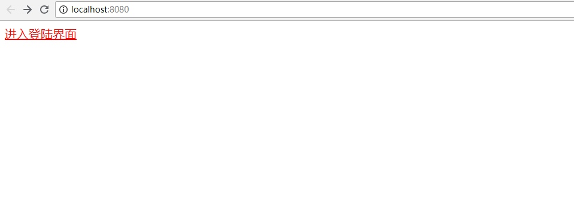
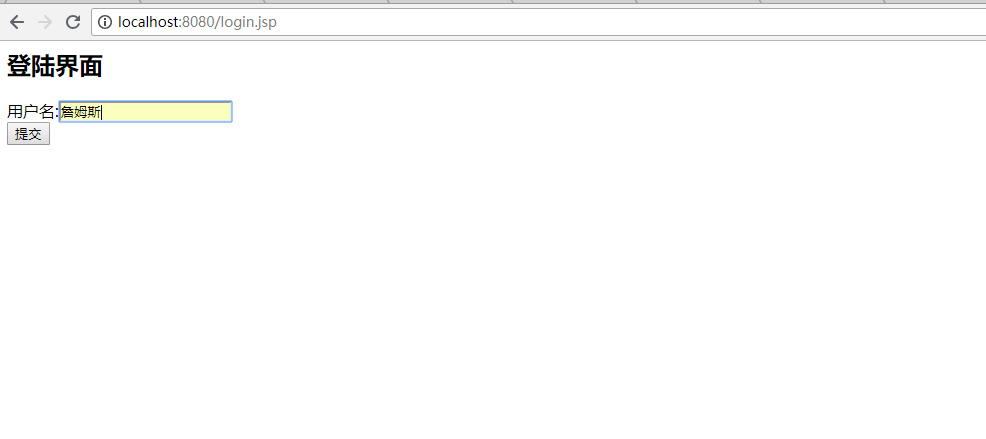
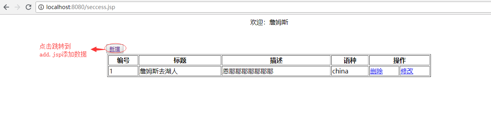
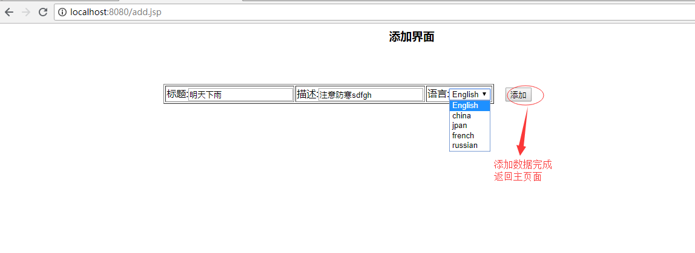
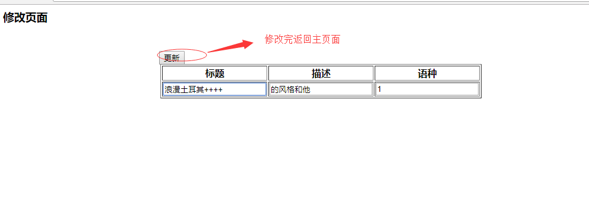
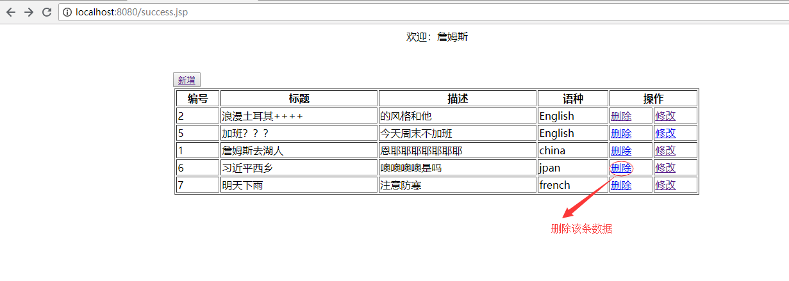
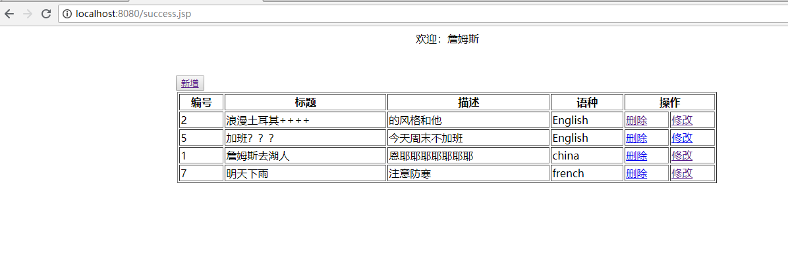

* 初始界面

* 登陆界面，用户名为:詹姆斯,在还没登陆之前不能进入add.jsp、success.jsp、update.jsp界面

* 主界面，有添加、删除、修改操作

* 添加界面，添加数据完成返回主页面

* 修改界面

* 删除操作

* 删除之后的数据

- github地址：https://github.com/yangguangru168/study.git
- 数据库的脚本代码在：mysql文件夹